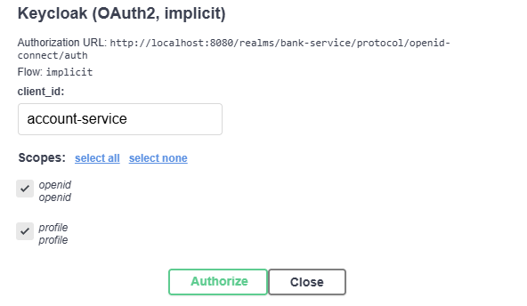
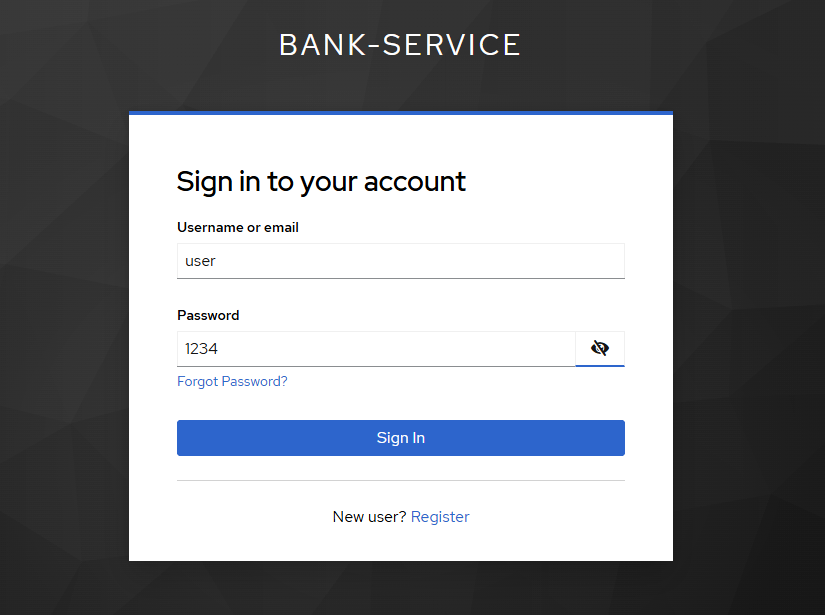

# 🛡️ AccountService — ASP.NET Core API + Keycloak Auth + Postgresql

Этот проект представляет собой REST API, разработанный на ASP.NET Core, с интеграцией авторизации через **Keycloak**. Контейнеризация выполнена с помощью `Docker` и `docker-compose`, для удобного запуска в разработке и отладке.

---

## 📦 Состав проекта

- `AccountService` — ASP.NET Core Web API
- `Keycloak` — система аутентификации и управления пользователями (SSO)
- `Postgresql` - база данных
- `docker-compose.yml` — объединяет все сервисы в единое окружение

---

## 🚀 Быстрый старт

### 🔁 Запуск через `docker-compose`

Убедитесь, что установлены:

- [Docker](https://www.docker.com/)
- [Docker Compose](https://docs.docker.com/compose/)

#### 📥 Шаги:

```bash
# 1. Клонируйте репозиторий
git clone https://github.com/MagomedYasulov/AccountService.git
cd AccountService

# 2. Запустите сервисы
docker-compose up --build
```
Либо можно выбрать запускаемый проект docker-compose в Visual Studio.

После запуска:

- 🌐 API будет доступен по адресу: [http://localhost:80/swagger](http://localhost:80/swagger)

- 🔐 Keycloak: [http://localhost:8080](http://localhost:8080)  
  (запускается обычно чуть дольше остальных сервисов)  
  **Данные для входа по умолчанию:**
  - Логин: `admin`  
  - Пароль: `admin`
- 🗄️ Postgresql: [http://localhost:5432](http://localhost:5432)
  - User: `postgres`
  - Пароль: `1234` 

Keycloak
---
По умолчанию в Keycloak импортирован realm client и пользователь
- realm: `bank-service`
- client: `account-service`
- user: 
	- Логин: `user`
	- Пароль: `1234`

Swagger Autorization
---
Для авторизации в Swagger можно использовать Keycloak  (OAuth2,  implicit) , с client_id `account-service`
  
После чего на странице авторизации Keycloak ввести данные импортированного пользователя
- Логин: `user`
- Пароль: `1234`  

Либо зарегистрировать нового пользователя



Так можно получить токен напрямую используя curl или Postman и вставить его в Swagger
```bash
curl -X POST "http://localhost:8080/realms/bank-service/protocol/openid-connect/token" \
  -H "Content-Type: application/x-www-form-urlencoded" \
  -d "client_id=accout-service" \
  -d "grant_type=password" \
  -d "username=user" \
  -d "password=1234"
```
# DeliveryService.Backend
#### API
Документаця по API доступнапо адрессу http://localhost:5109/swagger/index.html
#### Logging
Логирование в файл и на консоль происходит с помощью NLog. Путь до лог файла можно найти и изменить в конфиге nlog.config
#### Входные данные
Проект содержит готовую SQLite DB DeliveryService.db с тестовыми данными.
